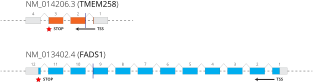
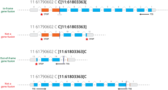

## Overview

Gene fusions often result from large genomic rearrangements such as structural variants. While WGS secondary analysis pipelines typically contain alignment and variant calling stages, very few of them contain dedicated gene fusion callers. When they are included, they are usually associated with RNA-Seq pipelines where gene fusions can be readily observed.

Since gene fusions are frequently observed in cancer and since many sequencing experiments do not include paired RNA-Seq data, we have added gene fusion detection and annotation to Nirvana.

The rich diversity in gene fusion architectures and their likely mechanisms can be seen below:


:::info Publication
Kumar-Sinha, C., Kalyana-Sundaram, S. & Chinnaiyan, A.M. [Landscape of gene fusions in epithelial cancers: seq and ye shall find](https://genomemedicine.biomedcentral.com/articles/10.1186/s13073-015-0252-1). Genome Med 7, 129 (2015)
:::

## Approach

Nirvana uses structural variant calls to evaluate if they form either putative intra-chromosomal or inter-chromosomal gene fusions. Let's consider two transcripts, `NM_014206.3` (**TMEM258**) and `NM_013402.4` (**FADS1**). Both of these genes are on the reverse strand in the genome. The vertical bar indicates the breakpoint where these transcripts are fused:



The above explains where the transcripts are fused together, but it doesn't explain in which orientation. By using the directionality encoded in the translocation breakend, we can rearrange these two transcripts in four ways:



Only two of the combinations yields a fusion contains both the transcription start site (TSS) and the stop codon. In one case, we can even detect an in-frame gene fusion.

:::info Interpreting translocation breakends

At first glance, translocation breakends are a bit daunting. However, once you understand how they work, they're actually quite simple. For more information, we recommend reading section 5.4 in the [VCF 4.2 specification](https://samtools.github.io/hts-specs/VCFv4.2.pdf).

| REF | ALT  | Meaning                                                    |
|:----|:-----|:-----------------------------------------------------------|
| s   | t[p[ | piece extending to the right of p is joined after t        |
| s   | t]p] | reverse comp piece extending left of p is joined after t   |
| s   | ]p]t | piece extending to the left of p is joined before t        |
| s   | [p[t | reverse comp piece extending right of p is joined before t |
:::

### Variant Types

Specifically we can identify gene fusions from the following structural variant types:
* deletions (`<DEL>`)
* tandem_duplications (`<DUP:TANDEM>`)
* inversions (`<INV>`)
* translocation breakpoints (`AAAAAAAAAAAAAAAAAATTAGTCAGGCAC[chr3:153444911[`) 

### Criteria

The following criteria must be met for Nirvana to identify a gene fusion:
1. After accounting for gene orientation and genomic rearrangements, both transcripts must have the same orientation
1. Both transcripts must be from the same transcript source (i.e. we won't mix and match between RefSeq and Ensembl transcripts)
1. Both transcripts must belong to different genes
1. Both transcripts cannot have a coding region that already overlaps without the variant (i.e. in cases where two genes naturally overlap, we don't want to call a gene fusion)

## ETV6/RUNX1 Example

ETV6/RUNX1 is the most common gene fusion in childhood B-cell precursor acute lymphoblastic leukemia (ALL). Patients with this translocation are associated with a good prognosis and excellent response to treatment.

:::info Publication
Sun C., Chang L., Zhu X. [Pathogenesis of ETV6/RUNX1-positive childhood acute lymphoblastic leukemia and mechanisms underlying its relapse](https://www.oncotarget.com/article/16367/text/). Oncotarget. 2017; 8: 35445-35459
:::

### VCF

Here's a simplified representation of the translocation breakends called by the Manta structural variant caller:

```scss
##fileformat=VCFv4.1
#CHROM  POS     ID      REF     ALT     QUAL    FILTER  INFO
chr12	12026270	.	C	[chr21:36420865[C	.	PASS	SVTYPE=BND
chr12	12026305	.	A	A]chr21:36420571]	.	PASS	SVTYPE=BND
chr21	36420571	.	C	C]chr12:12026305]	.	PASS	SVTYPE=BND
chr21	36420865	.	C	[chr12:12026270[C	.	PASS	SVTYPE=BND
```

When you put these calls together, the resulting genomic rearrangement looks something like this:


### JSON Output

The annotation for the first variant in the VCF looks like this:

```json {139,141-198,211,213-222}
{
  "chromosome": "chr12",
  "position": 12026270,
  "refAllele": "C",
  "altAlleles": [
    "[chr21:36420865[C"
  ],
  "filters": [
    "PASS"
  ],
  "cytogeneticBand": "12p13.2",
  "clingen": [
    {
      "chromosome": "12",
      "begin": 173786,
      "end": 34835837,
      "variantType": "copy_number_gain",
      "id": "nsv995956",
      "clinicalInterpretation": "pathogenic",
      "phenotypes": [
        "Decreased calvarial ossification",
        "Delayed gross motor development",
        "Feeding difficulties",
        "Frontal bossing",
        "Morphological abnormality of the central nervous system",
        "Patchy alopecia"
      ],
      "phenotypeIds": [
        "HP:0002007",
        "HP:0002011",
        "HP:0002194",
        "HP:0002232",
        "HP:0005474",
        "HP:0011968",
        "MedGen:C0232466",
        "MedGen:C1862862",
        "MedGen:CN001816",
        "MedGen:CN001820",
        "MedGen:CN001989",
        "MedGen:CN004852"
      ],
      "observedGains": 1,
      "validated": true
    }
  ],
  "variants": [
    {
      "vid": "12-12026270-C-[chr21:36420865[C",
      "chromosome": "chr12",
      "begin": 12026270,
      "end": 12026270,
      "isStructuralVariant": true,
      "refAllele": "C",
      "altAllele": "[chr21:36420865[C",
      "variantType": "translocation_breakend",
      "cosmicGeneFusions": [
        {
          "id": "COSF2245",
          "numSamples": 249,
          "geneSymbols": [
            "ETV6",
            "RUNX1"
          ],
          "hgvsr": "ENST00000396373.4(ETV6):r.1_1283::ENST00000300305.3(RUNX1):r.504_6222",
          "histologies": [
            {
              "name": "acute lymphoblastic B cell leukaemia",
              "numSamples": 169
            },
            {
              "name": "acute lymphoblastic leukaemia",
              "numSamples": 80
            }
          ],
          "sites": [
            {
              "name": "haematopoietic and lymphoid tissue",
              "numSamples": 249
            }
          ],
          "pubMedIds": [
            7761424,
            7780150,
            8609706,
            8751464,
            8982044,
            9067587,
            9207408,
            9226156,
            9628428,
            10463610,
            10774753,
            11091202,
            12621238,
            12661004,
            12750722,
            15104290,
            15642392,
            24557455,
            26925663
          ]
        }
      ],
      "fusionCatcher": [
        {
          "genes": {
            "first": {
              "hgnc": "ETV6",
              "isOncogene": true
            },
            "second": {
              "hgnc": "RUNX1",
              "isOncogene": true
            }
          },
          "somaticSources": [
            "DepMap CCLE",
            "Cancer Genome Project",
            "ChimerKB 4.0",
            "ChimerPub 4.0",
            "ChimerSeq 4.0",
            "Known",
            "Mitelman DB",
            "OncoKB",
            "TICdb"
          ]
        }
      ],
      "transcripts": [
        {
          "transcript": "ENST00000396373.4",
          "source": "Ensembl",
          "bioType": "protein_coding",
          "introns": "5/7",
          "geneId": "ENSG00000139083",
          "hgnc": "ETV6",
          "consequence": [
            "transcript_variant",
            "unidirectional_gene_fusion"
          ],
          "geneFusions": [
            {
              "transcript": "ENST00000437180.1",
              "bioType": "protein_coding",
              "intron": 2,
              "geneId": "ENSG00000159216",
              "hgnc": "RUNX1",
              "hgvsr": "ENST00000437180.1(RUNX1):r.?_58+274::ENST00000396373.4(ETV6):r.1009+3367_?"
            },
            {
              "transcript": "ENST00000300305.3",
              "bioType": "protein_coding",
              "intron": 1,
              "geneId": "ENSG00000159216",
              "hgnc": "RUNX1",
              "hgvsr": "ENST00000300305.3(RUNX1):r.?_58+274::ENST00000396373.4(ETV6):r.1009+3367_?"
            },
            {
              "transcript": "ENST00000482318.1",
              "bioType": "nonsense_mediated_decay",
              "intron": 2,
              "geneId": "ENSG00000159216",
              "hgnc": "RUNX1",
              "hgvsr": "ENST00000482318.1(RUNX1):r.?_58+274::ENST00000396373.4(ETV6):r.1009+3367_?"
            },
            {
              "transcript": "ENST00000486278.2",
              "bioType": "protein_coding",
              "intron": 2,
              "geneId": "ENSG00000159216",
              "hgnc": "RUNX1",
              "hgvsr": "ENST00000486278.2(RUNX1):r.?_-15+274::ENST00000396373.4(ETV6):r.1009+3367_?"
            },
            {
              "transcript": "ENST00000455571.1",
              "bioType": "protein_coding",
              "intron": 2,
              "geneId": "ENSG00000159216",
              "hgnc": "RUNX1",
              "hgvsr": "ENST00000455571.1(RUNX1):r.?_58+274::ENST00000396373.4(ETV6):r.1009+3367_?"
            },
            {
              "transcript": "ENST00000475045.2",
              "bioType": "protein_coding",
              "intron": 11,
              "geneId": "ENSG00000159216",
              "hgnc": "RUNX1",
              "hgvsr": "ENST00000475045.2(RUNX1):r.?_58+274::ENST00000396373.4(ETV6):r.1009+3367_?"
            },
            {
              "transcript": "ENST00000416754.1",
              "bioType": "protein_coding",
              "intron": 2,
              "geneId": "ENSG00000159216",
              "hgnc": "RUNX1",
              "hgvsr": "ENST00000416754.1(RUNX1):r.?_58+274::ENST00000396373.4(ETV6):r.1009+3367_?"
            }
          ],
          "isCanonical": true,
          "proteinId": "ENSP00000379658.3"
        },
        {
          "transcript": "NM_001987.4",
          "source": "RefSeq",
          "bioType": "protein_coding",
          "introns": "5/7",
          "geneId": "2120",
          "hgnc": "ETV6",
          "consequence": [
            "transcript_variant",
            "unidirectional_gene_fusion"
          ],
          "geneFusions": [
            {
              "transcript": "NM_001754.4",
              "bioType": "protein_coding",
              "intron": 2,
              "geneId": "861",
              "hgnc": "RUNX1",
              "hgvsr": "NM_001754.4(RUNX1):r.?_58+274::NM_001987.4(ETV6):r.1009+3367_?"
            }
          ],
          "isCanonical": true,
          "proteinId": "NP_001978.1"
        }
      ]
    }
  ]
}
```

| Field            | Type   | Notes                                     |
|:-----------------|:------:|:------------------------------------------|
| transcript       | string | transcript ID                             |
| bioType          | string | descriptions of the [biotypes from Ensembl](https://uswest.ensembl.org/info/genome/genebuild/biotypes.html) |
| exon             | int    | exon that contained fusion breakpoint     |
| intron           | int    | intron that contained fusion breakpoint   |
| geneId           | string | gene ID. e.g. ENSG00000116062             |
| hgnc             | string | gene symbol. e.g. MSH6                    |
| hgvsr            | string | HGVS RNA nomenclature                     |

#### Gene Fusion Data Sources

To provide more context to our gene fusions, we provide the following gene fusion data sources:
* [COSMIC](../data-sources/cosmic)
* [FusionCatcher](../data-sources/fusioncatcher)

#### Consequences

When a gene fusion is identified, we add the following Sequence Ontology consequence:

```json {3}
              "consequence": [
                "transcript_variant",
                "unidirectional_gene_fusion"
              ],
```

#### Gene Fusions Section

The `geneFusions` section is contained within the object of the originating transcript. It will contain all the pairwise gene fusions that obey the criteria outline above. In the case of `ENST00000396373.4`, there 7 other Ensembl transcripts that would produce a gene fusion. For `NM_001987.4`, there was only one transcript (`NM_001754.4`) that produce a gene fusion.

For each originating transcript, we report the following for each partner transcript:
* transcript ID
* gene ID
* HGNC gene symbol
* transcript bio type (e.g. protein_coding)
* intron or exon number containing the breakpoint
* HGVS RNA notation

:::tip
Before Nirvana 3.15, we provided HGVS coding notation. However, HGVS r. notation is more appropriate for these types fusion splicing events (see [HGVS SVD-WG007](https://varnomen.hgvs.org/bg-material/consultation/svd-wg007)).
:::

```json {8}
          "geneFusions": [
            {
              "transcript": "NM_001754.4",
              "bioType": "protein_coding",
              "intron": 2,
              "geneId": "861",
              "hgnc": "RUNX1",
              "hgvsr": "NM_001754.4(RUNX1):r.?_58+274::NM_001987.4(ETV6):r.1009+3367_?"
            }
          ],
```

The HGVS RNA notation above indicates that the gene fusion starts with `NM_001754.4` (RUNX1) until CDS position 58 and continues with `NM_001987.4` (ETV6). `1009+3367` indicates that the fusion occurred 3367 bp within intron 2.

