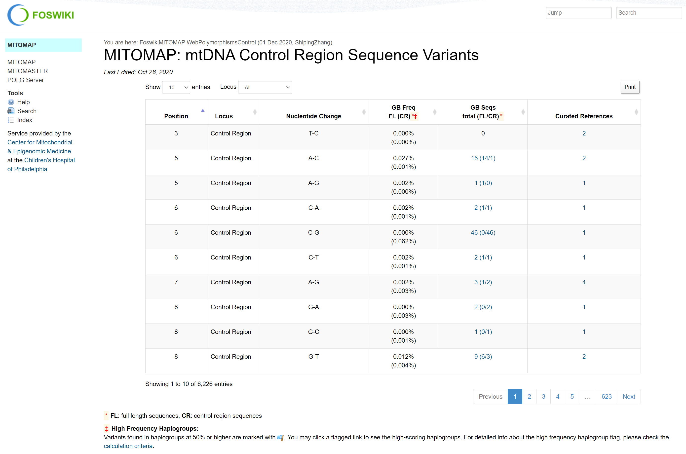

import SmallJSON from './mitomap-small-variants-json.md'
import SVJSON from './mitomap-structural-variants-json.md'

## Overview

MITOMAP provides a compendium of polymorphisms and mutations in human mitochondrial DNA.

:::info Publication
Lott, M.T., Leipzig, J.N., Derbeneva, O., Xie, H.M., Chalkia, D., Sarmady, M., Procaccio, V., and Wallace, D.C. mtDNA variation and analysis using MITOMAP and MITOMASTER. *Current Protocols in Bioinformatics* 1(123):1.23.1-26 (2013). [http://www.mitomap.org](http://www.mitomap.org)
:::

## Scraping HTML Pages

### Example

MITOMAP is unique in that it doesn't offer the data in a downloadable format. As a result, the annotation content in Nirvana is scraped from the following MITOMAP pages:
1. [mtDNA Control Region Sequence Variants](https://mitomap.org/foswiki/bin/view/MITOMAP/PolymorphismsControl)
1. [mtDNA Coding Region & RNA Sequence Variants](https://mitomap.org/foswiki/bin/view/MITOMAP/PolymorphismsCoding)
1. [Reported Mitochondrial DNA Base Substitution Diseases: rRNA/tRNA mutations](https://mitomap.org/foswiki/bin/view/MITOMAP/MutationsRNA)
1. [Reported Mitochondrial DNA Base Substitution Diseases: Coding and Control Region Point Mutations](https://mitomap.org/foswiki/bin/view/MITOMAP/MutationsCodingControl)
1. [Reported mtDNA Deletions](https://mitomap.org/foswiki/bin/view/MITOMAP/DeletionsSingle)
1. [mtDNA Simple Insertions](https://mitomap.org/foswiki/bin/view/MITOMAP/InsertionsSimple)



### Parsing

Here's what the HTML code looks like:

```html
["582","<a href='/MITOMAP/GenomeLoci#MTTF'>MT-TF</a>","Mitochondrial myopathy","T582C","tRNA Phe","-","+","Reported","<span style='display:inline-block;white-space:nowrap;'><a href='/cgi-bin/mitotip?pos=582&alt=C&quart=2'><u>72.90%</u></a> <i class='fa fa-arrow-up' style='color:orange' aria-hidden='true'></i></span>","0","<a href='/cgi-bin/print_ref_list?refs=90165,91590&title=RNA+Mutation+T582C' target='_blank'>2</a>"],
["583","<a href='/MITOMAP/GenomeLoci#MTTF'>MT-TF</a>","MELAS / MM & EXIT","G583A","tRNA Phe","-","+","Cfrm","<span style='display:inline-block;white-space:nowrap;'><a href='/cgi-bin/mitotip?pos=583&alt=A&quart=0'><u>93.10%</u></a> <i class='fa fa-arrow-up' style='color:red' aria-hidden='true'></i><i class='fa fa-arrow-up' style='color:red' aria-hidden='true'></i><i class='fa fa-arrow-up' style='color:red' aria-hidden='true'></i></span>","0","<a href='/cgi-bin/print_ref_list?refs=2066,90532,91590&title=RNA+Mutation+G583A' target='_blank'>3</a>"],
```

We're mainly interested in the following columns (numbers indicate the HTML page above):
* Position<sup>1,2,3,4</sup>
* Disease<sup>3,4</sup>
* Nucleotide Change<sup>1,2</sup>
* Allele<sup>3,4</sup>
* Homoplasmy<sup>3,4</sup>
* Heteroplasmy<sup>3,4</sup>
* Status<sup>3,4</sup>
* MitoTIP<sup>3,4</sup>
* GB Seqs FL(CR)<sup>1,2,3,4</sup>
* Deletion Junction<sup>5</sup>
* Insert (nt)<sup>6</sup>
* Insert Point (nt)<sup>6</sup>
* References/Curated References<sup>1,2,3,4</sup>

:::info MitoTIP
The MitoTIP information is used to populate the `clinicalSignificance` and `scorePercentile` JSON keys. The "frequency alert" entries are skipped since it's not directly relevant to clinical significance.
:::

:::info Left alignment
Many of the variants in MITOMAP have not been normalized. As part of our import procedure, we left align all insertions and deletions.
:::

:::info Variant Enumeration
Sometimes MITOMAP provides data that indicates that multiple values have been observed. Some examples of this are `C-C(2-8)` and `A-AC or ACC`. Alternate alleles containing IUPAC ambiguity codes are similarly enumerated.
:::

:::info Inversions
MITOMAP inversions are currently treated as MNVs.
:::

#### Allele Parsing

The following MITOMAP allele parsing conventions are supported:
* C123T
* 16021_16022del
* 8042del2
* C9537insC
* 3902_3908invACCTTGC
* A-AC or ACC
* C-C(2-8)
* 8042delAT

## PostgreSQL Dump File

### Example

```scss
COPY mitomap.reference (id, authors, title, publication, editors, volume, number, pages, date, city, publisher, keywords, abstract, nlmid) FROM stdin;
1       Albring, M., Griffith, J. and Attardi, G.       Association of a protein structure of probable membrane derivation with HeLa cell mitochondrial DNA near its origin of replication      Proceedings of the National Academy of Sciences of the United States of America .       74      4       1348-1352       1977    .       .       Deoxyribonucleoproteins; DNA Replication; DNA, Mitochondrial; Hela Cells; Membrane Proteins; Microscopy, Electron; Molecular Weight; Neoplasm Proteins; Protein Binding Almost all (about 95 percent) of the mitochondrial DNA molecules released by Triton X-100 lysis of HeLa cell mitochondria in the presence of 0.15 M salt are associated with a single protein-containing structure varying in appearance between a 10-20 nm knob and a 100-500 nm membrane-like patch. Analysis by high resolution electron microscopy and by polyacrylamide gel electrophoresis after cleavage of mitochondrial DNA with the endonucleases EcoRI, HindIII, and Hpa II has shown that the protein structure is attached to the DNA in the region of the D-loop, and probably near the origin of mitochondrial DNA replication. The data strongly suggest that HeLa cell mitochondrial DNA is attached in vivo to the inner mitochondrial membrane at or near the origin of replication, and that a membrane fragment of variable size remains associated with the DNA during the isolation. After sodium dodecyl sulfate extraction of mitochondrial DNA, a small 5-10 nm protein is found at the same site on a fraction of the mitochondrial DNA molecules.   266177
2       Anderson, S., Bankier, A.T., Barrell, B.G., de Bruijn, M.H., Coulson, A.R., Drouin, J., Eperon, I.C., Nierlich, D.P., Roe, B.A., Sanger, F., Schreier, P.H., Smith, A.J., Staden, R., Young, I.G.       Sequence and organization of the human mitochondrial genome     Nature  .       290     5806    457-465 1981    .       .       Base Sequence; Codon; DNA Replication; mtDNA; Evolution; Genes, Structural; Human; Nucleic Acid Precursors; Peptide Chain Initiation; Peptide Chain Termination; RNA, Ribosomal; RNA, Transfer; Transcription, Genetic  The complete sequence of the 16,569-base pair human mitochondrial genome is presented. The genes for the 12S and 16S rRNAs, 22 tRNAs, cytochrome c oxidase subunits I, II and III, ATPase subunit 6, cytochrome b and eight other predicted protein coding genes have been located. The sequence shows extreme economy in that the genes have none or only a few noncoding bases between them, and in many cases the termination codons are not coded in the DNA but are created post- transcriptionally by polyadenylation of the mRNAs.       7219534
```

### Parsing

From the PostgreSQL dump file, we're interested in parsing the mapping between reference IDs and the PubMed IDs:
* id
* nlmid

:::info Why not use the PostgreSQL file for everything?
Ideally we would use this file for parsing all of our data, but the schema contains 80+ tables and we haven't invested the time yet to see how the tables are linked together to produce the 6 main HTML pages that we're interested in.
:::

## Known Issues

:::caution Duplicated records
Multiple records describing the same nucleotide change are merged into the same record. If any conflicting information is found (homoplasmy, heteroplasmy, status, clinical significance, score percentile, end coordinate, variant type), an exception is thrown.

* For diseases and PubMed IDs, we take the union of the values in the duplicated records.
* For full length GenBank sequences, we take the largest number from each of the duplicated records since it provides the strongest evidence for this variant.
:::

:::caution Skipped records
Records that represent an alternate notation of the original variant are skipped. Similarly some variants with confusing alleles (T961delT+ / -C(n)ins) are also skipped.
:::

## Download URLs

* see [HTML Pages](#example) above
* [PostgreSQL dump file](https://mitomap.org/downloads/mitomap.dump.sql.gz)

## JSON Output

### Small Variants

<SmallJSON />

### Structural Variants

<SVJSON />
